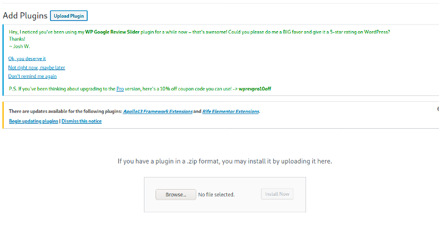
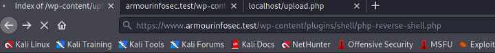

# Vul_Wordpress_Plugin

#### This is wordpress plugin which contain basic malicious code

Here it is in Zip format you can extract it or I am also giving in simple .php file format also. Here Idea is very simple sometimes when we get wordpress credentials using enumeration phase out first attempt is that we upload some malicious code and get the reverse shell but unexpected error came sometimes.

So here is the solution if we have admin write means we are able to upload wordpress plugin So directly we upload this plugin and get the reverse shell of www-data user.

## Usage:

Just upload this zip file and activate the plugin 



This is the directory where wordpress plugin mostly stores hence our plugin shell is also uploaded here.
```
$ /var/www/html/wp-content/plugins/shell

```



Then 
```
$ https://www.armourinfosec.test/wp-content/plugins/shell/upload.php
```


Then just execute the our reverse shell file using browser and gets the reverse shell.
```
$ https://www.armourinfosec.test/wp-content/plugins/shell/php-reverse-shell.php
```


### command execution


